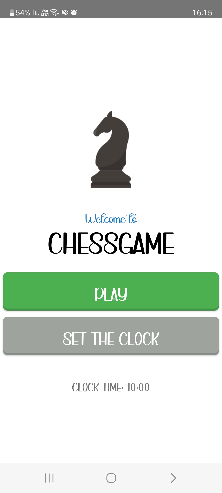
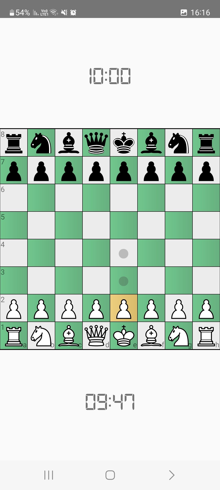
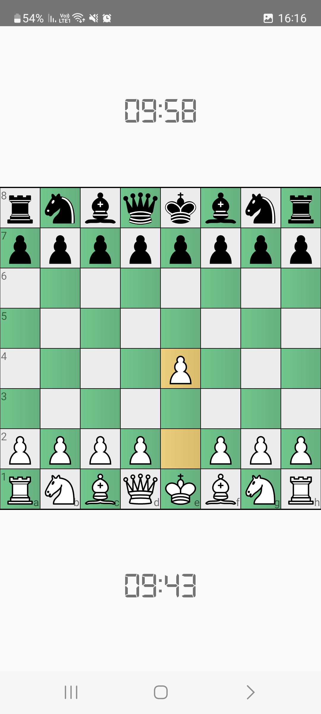
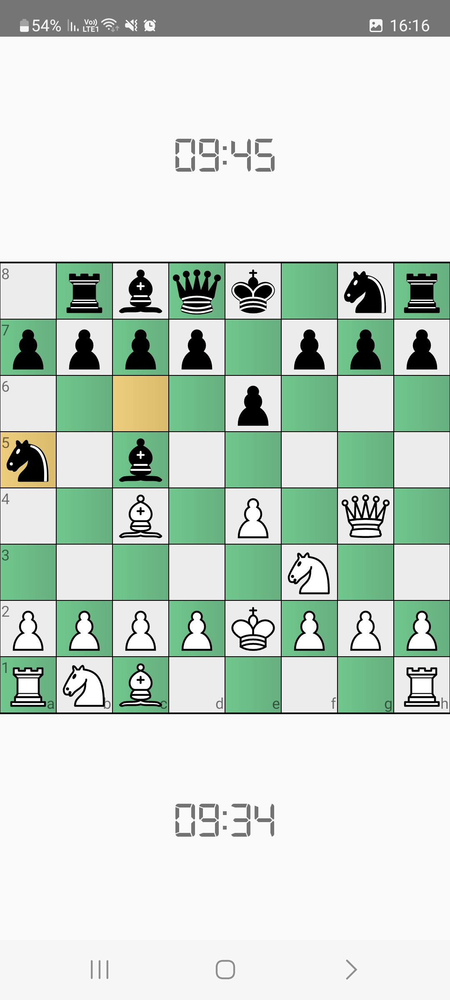

# ChessGame
An implementation of the popular game in Java, as a mobile app.  

**Version 1.0:**  
The app offers four distinct game modes:
* Bullet: A quick-paced game with a 2-minute timer.
* Blitz: A moderately-paced game with a 5-minute timer.
* Rapid: A game with a 10-minute timer for more thoughtful moves.
* Unlimited: A mode without any time restrictions, allowing for leisurely gameplay.

The core algorithm employed to simulate a chess player (the opponent with whom the user plays) is the Negamax algorithm. The evaluation function used in this implementation is based on the following criteria:
* Material Value: Assigning values to pieces (pawn=1, bishop&knight=3, rook=5, queen=9).
* Mobility: Evaluating the sum of all possible moves for each piece.
* Piece Development: Offering bonuses for occupying the middle rows of the board, promoting active piece development.
* King's Safety: Penalizing exposure to check and providing bonuses for the king being side-positioned, encouraging castling.
* Pawn Structures: Penalizing double pawns while rewarding the potential for passed pawns, reflecting the importance of pawn structure in chess strategy.

Screenshots:    

SVG vectors used:
* https://www.freepik.com/free-vector/chess_2900822.htm#query=chess&position=3&from_view=author (for the menu screen)
* https://commons.wikimedia.org/wiki/Category:SVG_chess_pieces (for the chess pieces)

Fonts used:
* https://www.dafont.com/digital-7.font
* https://www.dafont.com/farmhouse-20.font
* https://www.dafont.com/icons-south-st.font
* https://www.dafont.com/special-forces.font
* https://www.dafont.com/writer.font
